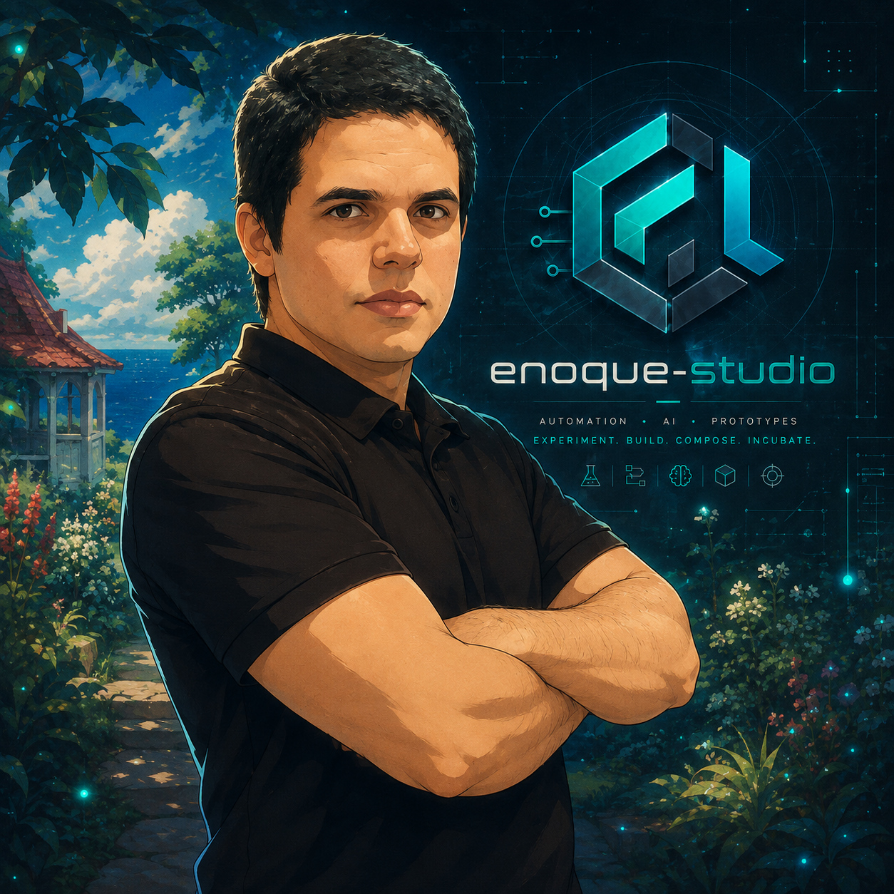

# Enoque Studio

**Software for critical operations, automation and connected products.**

Independent engineering studio maintained by [Enoque Sousa](https://github.com/enoquesousa) in São Paulo, Brazil.

## What we build

Enoque Studio brings together production software, operational tooling and focused experiments. The work is grounded in real environments: food-service operations, fleet management, observability, data analysis and telemetry-driven products.

Our main engineering areas are:

- **Operational systems** — fleet administration, support workflows and production observability.
- **Data and automation** — integrations, analytical dashboards and repeatable operational processes.
- **Product engineering** — APIs, web applications and native services designed as maintainable modules.
- **Applied AI** — practical prototypes and developer tools with clear operational value.

## Current repositories

| Repository | Purpose | Visibility |
| --- | --- | --- |
| [portfolio-v4](https://github.com/enoque-studio/portfolio-v4) | Trilingual portfolio and public engineering profile | Private |
| [godeploy-platform](https://github.com/enoque-studio/godeploy-platform) | Self-hosted deployment platform with Git webhooks, Docker builds and domain routing | Public |
| [ia-mobile-to-desktop-write](https://github.com/enoque-studio/ia-mobile-to-desktop-write) | Encrypted local-first clipboard sync between Windows and Android | Public |
| [veloryft-hud](https://github.com/enoque-studio/veloryft-hud) | Low-latency Windows telemetry HUD with a native Direct2D overlay | Public |
| [engineering-overview-pro](https://github.com/enoque-studio/engineering-overview-pro) | Dynamic SVG engineering cards for GitHub profiles | Public |
| [github-timeline](https://github.com/enoque-studio/github-timeline) | Visual timeline of GitHub activity | Public |

## Engineering principles

- Prefer explicit contracts and modular boundaries.
- Design for observability, safe operation and maintainability.
- Keep credentials and private operational data out of source control.
- Document setup, architecture and validation close to the code.
- Treat automation as an auditable system, not a collection of shortcuts.

## Contributing and security

Each repository defines its own maturity, license and contribution process. Before opening a pull request, read the repository's documentation and existing issues. For security reports, use the private reporting channel described in that project's `SECURITY.md` when available; do not disclose vulnerabilities in a public issue.

## Contact

- Website: [enoquesousa.com](https://enoquesousa.com)
- GitHub: [@enoquesousa](https://github.com/enoquesousa)
- LinkedIn: [Enoque Sousa](https://www.linkedin.com/in/enoque-sousa-bb89aa168/)
